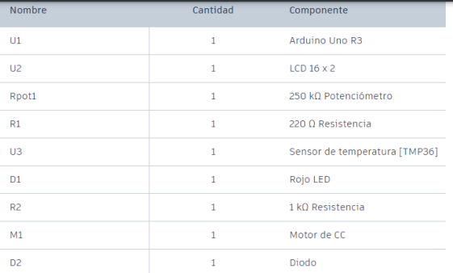

# OS-2024

## Taller de Arduino 1
Prender un led con el siguientes requerimientos.

Resuelve los siguientes requerimientos:
1. Crea el código fuente que permita controlar el encendido y apagado de luces de la vivienda desde la
consola de Arduino (Serial Monitor).
2. Validación 1. Al presionar el número 1, debe encender la luz verde.
3. Validación 2. Al presionar el número 2, debe apagar la luz verde. (* Refactoriza la opción 1 y 2)
4. Validación 3. Al presionar el número 3, debe encender la luz roja.
5. Validación 4. Al presionar el número 4, debe apagar la luz roja. (* Refactoriza la opción 3 y 4)
6. Validación 5. Al presionar el número 5, debe encender la luz amarilla.
7. Validación 6. Al presionar el número 6, debe apagar la luz amarilla. (* Refactoriza la opción 5 y 6)
8. Validación 7. Al presionar el número 7, debe encender todas las luces.
9. Validación 8. Al presionar el número 8, debe apagar todas las luces. (* Refactoriza la opción 7 y 8)
10. Validación 9. Al presionar el número 9, debe poner las luces en modo intermitente.

### Componentes

---
# Taller 2

Resuelve los siguientes requerimientos:
1. Crea el código fuente que permita visualizar por consola (Serial Monitor) el valor de la temperatura.
2. Validación 1. Si la temperatura es inferior a 5 °C, debe accionar el LED en intermitencia con retardo de
0.5 seg. 
3. Validación 2. Si la temperatura está entre 6 °C y 25 °C, debe apagar el LED (sin intermitencia). 
4. Validación 3. Si la temperatura es mayor a 25 °C, debe encender el LED (sin intermitencia) y el ventilador
(Motor). 

### Componentes

---